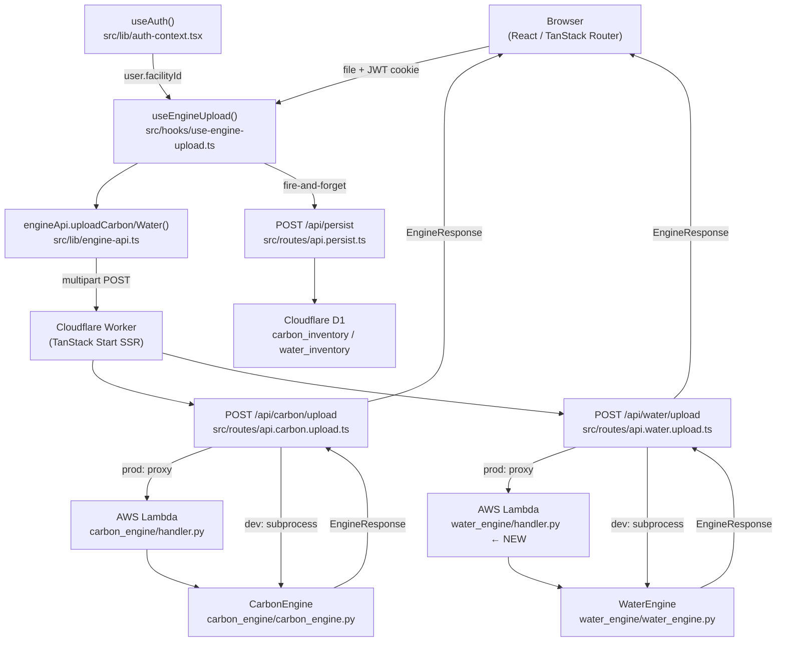
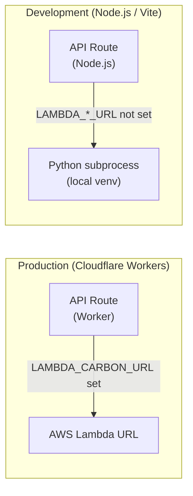
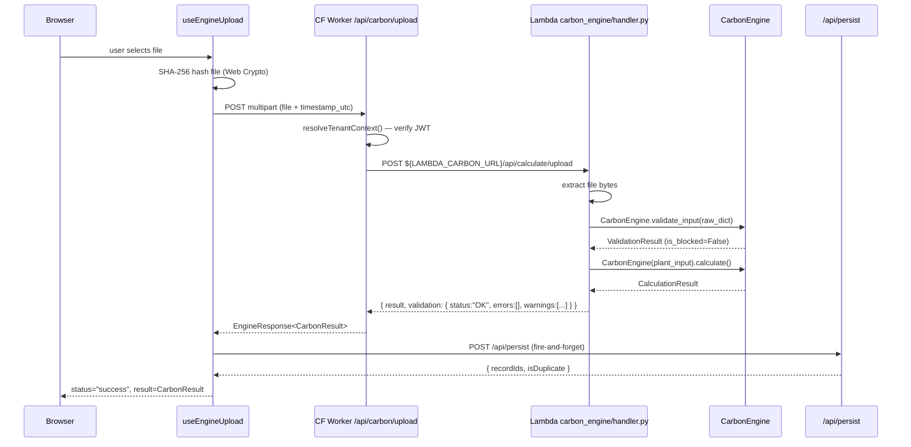
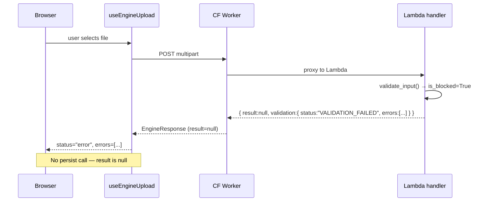
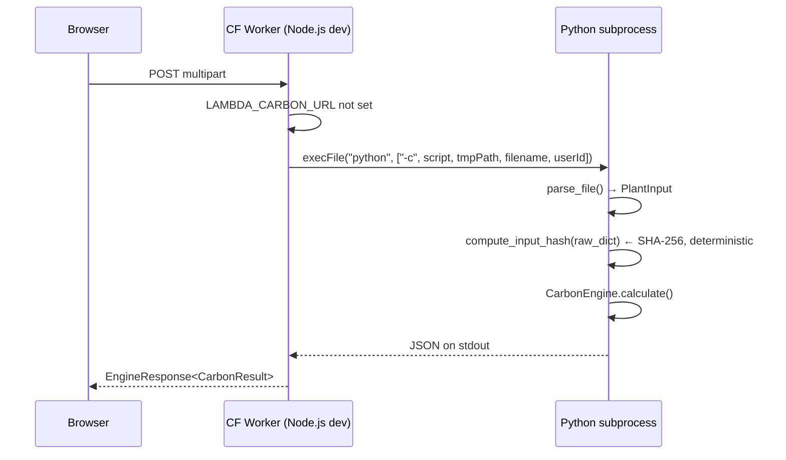

# Design Document: Full-Stack Integration

## Overview

The full-stack integration feature closes the gap between the Tefnut frontend (TanStack Start on Cloudflare Workers) and the Python calculation engines (Carbon and Water). The platform currently has a working carbon engine Lambda handler and a complete water engine Python class, but the two sides of the stack are not consistently wired together. Specifically: the water engine has no Lambda handler, both Lambda handlers return raw JSON instead of the agreed `EngineResponse<T>` envelope, the `facilityId` used for D1 persistence is hardcoded to `"default"` instead of being read from the authenticated user's JWT, the dev-path inline Python script computes an incorrect audit hash, and the Cloudflare Worker environment bindings for the Lambda URLs are not declared in `wrangler.jsonc`.

This document covers the full request flow from browser to engine and back, the unified response envelope contract, the design of the new `water_engine/handler.py`, the envelope fix for `carbon_engine/handler.py`, the `facilityId` dynamic resolution, the `wrangler.jsonc` environment bindings, and the dev-path audit hash correction.

---

## Architecture

### Full Request Flow



### Environment Routing



---

## Unified Response Envelope

### Contract

Every engine endpoint — whether served by Lambda or the dev subprocess — MUST return exactly this shape:

```typescript
// src/lib/engine-types.ts (already defined)
interface EngineResponse<T> {
  result: T | null;
  validation: {
    status: "OK" | "VALIDATION_FAILED" | "DUPLICATE_INPUT_DETECTED";
    errors: ValidationDetail[];
    warnings: ValidationDetail[];
  };
}
```

`result` is `null` when `validation.status === "VALIDATION_FAILED"`. It MAY be non-null when `status === "DUPLICATE_INPUT_DETECTED"` (the previous result is returned so the UI can display it).

### Python Envelope Helper

Both Lambda handlers share the same envelope-building logic. This is extracted into a helper in each handler module (not a shared library, to keep Lambda packages independent):

```python
def _engine_response(result_dict: dict | None, validation: ValidationResult) -> dict:
    """
    Build the unified EngineResponse envelope.
    result_dict: JSON-serialisable engine result, or None on validation failure.
    validation: ValidationResult from the engine's validate_input() call.
    """
    envelope = {
        "result": result_dict,
        "validation": validation.to_response_dict(),
    }
    # to_response_dict() already sets status, errors, warnings
    return envelope
```

`ValidationResult.to_response_dict()` (already implemented in `carbon_engine/validation.py`) returns:
- `{ "status": "VALIDATION_FAILED", "errors": [...], "warnings": [...] }` when `is_blocked` is True
- `{ "status": "OK", "warnings": [...] }` when valid (no `errors` key)

The proxy routes in TanStack Start normalise this to always include `errors: []` when absent.

---

## Components and Interfaces

### 1. `carbon_engine/handler.py` — Envelope Fix

**Current behaviour**: `_handle_upload` returns `{ result, parsed_input }`. `_handle_json` returns `result.model_dump_json()` as a raw string.

**Required change**: Both routes must call `validate_input()` first, then either return the validation failure envelope or run the calculation and return the success envelope.

```python
# Updated _handle_upload signature (internal)
def _handle_upload(event: dict) -> dict:
    # ... file extraction unchanged ...

    # 1. Validate
    timestamp_utc = _extract_header(event, "x-timestamp-utc") or datetime.utcnow().isoformat() + "Z"
    validation = CarbonEngine.validate_input(raw_data, timestamp_utc)
    if validation.is_blocked:
        return _ok(_engine_response(None, validation))

    # 2. Calculate
    plant_input = PlantInput.model_validate(raw_data)
    result = CarbonEngine(plant_input).calculate()

    # 3. Merge post-calc warnings into validation result
    for w in result.validation_warnings:
        validation.warnings.append(WarningDetail(**w))

    return _ok(_engine_response(json.loads(result.model_dump_json()), validation))
```

**Note**: The `parsed_input` field is dropped from the Lambda response. The proxy route already discards it; direct API consumers should not depend on it.

### 2. `water_engine/handler.py` — New Lambda Handler

Mirrors `carbon_engine/handler.py` exactly, substituting `WaterEngine` and `WaterInput`.

**Supported routes** (via API Gateway):
- `POST /api/water/upload` — multipart/form-data OR raw binary body

**File parsing**: The water engine does not have a `parse_file()` equivalent. The handler must parse the Excel/CSV inline using `pandas`, mirroring the dev-path script in `api.water.upload.ts` but with correct `AuditContext` construction.

```python
# water_engine/handler.py

import base64, cgi, io, json, logging
from datetime import datetime, timezone
from typing import Any

from water_engine.water_engine import (
    AuditContext, WaterEngine, WaterInput,
    WaterWithdrawal, WaterDischarge,
)
from carbon_engine.validation import ValidationResult, WarningDetail

logger = logging.getLogger()
logger.setLevel(logging.INFO)

_CORS_HEADERS = {
    "Content-Type": "application/json",
    "Access-Control-Allow-Origin": "*",
}

def _ok(body: Any) -> dict:
    return {"statusCode": 200, "headers": _CORS_HEADERS,
            "body": body if isinstance(body, str) else json.dumps(body)}

def _err(status: int, message: str, detail: Any = None) -> dict:
    payload: dict = {"error": message}
    if detail is not None:
        payload["detail"] = detail
    return {"statusCode": status, "headers": _CORS_HEADERS, "body": json.dumps(payload)}

def _engine_response(result_dict: dict | None, validation: ValidationResult) -> dict:
    return {"result": result_dict, "validation": validation.to_response_dict()}

def _extract_header(event: dict, name: str) -> str | None:
    for k, v in (event.get("headers") or {}).items():
        if k.lower() == name:
            return v
    return None

def _parse_water_input_from_file(file_bytes: bytes, filename: str) -> tuple[dict, WaterInput]:
    """
    Parse an Excel or CSV file into a WaterInput.
    Returns (raw_dict, WaterInput) so validate_input() can run on the raw dict.
    """
    import io as _io
    import pandas as pd

    buf = _io.BytesIO(file_bytes)
    if filename.lower().endswith((".xlsx", ".xls")):
        df = pd.read_excel(buf)
    else:
        df = pd.read_csv(buf)

    row = df.iloc[0].to_dict()

    def g(k: str, default: float = 0.0) -> float:
        return float(row.get(k, default) or default)

    raw_dict = {
        "withdrawal": {
            "surface_water": g("surface_water"),
            "groundwater": g("groundwater"),
            "quarry_water_used": g("quarry_water_used"),
            "municipal_potable_water": g("municipal_potable_water"),
            "external_wastewater": g("external_wastewater"),
            "harvested_rainwater": g("harvested_rainwater"),
        },
        "discharge": {
            "ocean": g("ocean"),
            "surface_water": g("discharge_surface_water"),
            "subsurface_well": g("subsurface_well"),
            "offsite_water_treatment": g("offsite_water_treatment"),
            "beneficial_other_users": g("beneficial_other_users"),
        },
        "quarry_water_not_used_m3_yr": g("quarry_water_not_used_m3_yr"),
        "recycled_water_m3_yr": g("recycled_water_m3_yr"),
        "storm_water_collected_discharged_m3_yr": g("storm_water_collected_discharged_m3_yr"),
        "cementitious_production_t_yr": g("cementitious_production_t_yr", 1.0),
    }

    water_input = WaterInput(
        withdrawal=WaterWithdrawal(**raw_dict["withdrawal"]),
        discharge=WaterDischarge(**raw_dict["discharge"]),
        quarry_water_not_used_m3_yr=raw_dict["quarry_water_not_used_m3_yr"],
        recycled_water_m3_yr=raw_dict["recycled_water_m3_yr"],
        storm_water_collected_discharged_m3_yr=raw_dict["storm_water_collected_discharged_m3_yr"],
        cementitious_production_t_yr=raw_dict["cementitious_production_t_yr"],
    )
    return raw_dict, water_input


def _handle_upload(event: dict) -> dict:
    content_type = _extract_header(event, "content-type") or ""
    filename = _extract_header(event, "x-filename") or "upload.xlsx"
    user_id = _extract_header(event, "x-user-id") or "anonymous"
    timestamp_utc = _extract_header(event, "x-timestamp-utc") or (
        datetime.now(timezone.utc).isoformat()
    )

    raw_body = event.get("body", "")
    is_b64 = event.get("isBase64Encoded", False)
    if isinstance(raw_body, str):
        body_bytes = base64.b64decode(raw_body) if is_b64 else raw_body.encode()
    else:
        body_bytes = raw_body

    try:
        if "multipart/form-data" in content_type:
            environ = {
                "REQUEST_METHOD": "POST",
                "CONTENT_TYPE": content_type,
                "CONTENT_LENGTH": str(len(body_bytes)),
            }
            import cgi as _cgi
            fs = _cgi.FieldStorage(
                fp=io.BytesIO(body_bytes), environ=environ, keep_blank_values=True
            )
            if "file" in fs:
                field = fs["file"]
                file_bytes, filename = field.file.read(), field.filename or filename
            else:
                file_bytes = body_bytes
        else:
            file_bytes = body_bytes
    except Exception as exc:
        return _err(400, "Could not extract file from request", str(exc))

    if not file_bytes:
        return _err(400, "Uploaded file is empty")

    try:
        raw_dict, water_input = _parse_water_input_from_file(file_bytes, filename)
    except Exception as exc:
        logger.exception("File parse error: %s", exc)
        return _err(422, "File parsing failed", str(exc))

    # Validate
    validation = WaterEngine.validate_input(raw_dict, timestamp_utc)
    if validation.is_blocked:
        return _ok(_engine_response(None, validation))

    # Calculate
    audit_ctx = AuditContext(
        source_filename=filename,
        upload_timestamp_utc=timestamp_utc,
        user_id=user_id,
    )
    try:
        result = WaterEngine(water_input, audit_ctx).calculate()
    except Exception as exc:
        logger.exception("Calculation error: %s", exc)
        return _err(500, "Calculation failed", str(exc))

    for w in result.validation_warnings:
        validation.warnings.append(WarningDetail(**w))

    return _ok(_engine_response(json.loads(result.model_dump_json()), validation))


def lambda_handler(event: dict, context: object) -> dict:
    try:
        path: str = event.get("path", "") or event.get("rawPath", "")
        logger.info("Water handler request path: %s", path)
        return _handle_upload(event)
    except Exception as exc:
        logger.exception("Unhandled error: %s", exc)
        return _err(500, "Internal server error")
```

### 3. `src/hooks/use-engine-upload.ts` — Dynamic `facilityId`

**Current**: `facilityId: "default"` hardcoded in `persistResult()` call.

**Required**: Read `facilityId` from `useAuth().user.facilityId`.

```typescript
// Add import at top of use-engine-upload.ts
import { useAuth } from "@/lib/auth-context";

// Inside useEngineUpload():
const { user } = useAuth();

// In handleFileChange, replace the hardcoded call:
if (response.result) {
  persistResult({
    type: engine,
    result: response.result,
    fileHash,
    fileName: file.name,
    fileSize: file.size,
    facilityId: user?.facilityId ?? "default",
  }).catch((err) => console.warn("[persist] D1 save failed:", err));
}
```

`user?.facilityId` is `string | null` from `AuthUser`. The fallback `"default"` is retained for unauthenticated dev scenarios only; in production the auth middleware on the API route will have already rejected unauthenticated requests.

### 4. `wrangler.jsonc` — Environment Variable Bindings

Cloudflare Workers do not inherit `process.env` from the host OS. Variables must be declared in `wrangler.jsonc` under `vars` (for non-secret values) or as secrets (for production URLs that should not be committed).

```jsonc
{
  "$schema": "node_modules/wrangler/config-schema.json",
  "name": "tanstack-start-app",
  "compatibility_date": "2025-09-24",
  "compatibility_flags": ["nodejs_compat"],
  "main": "@tanstack/react-start/server-entry",
  "vars": {
    // Placeholder values — override with `wrangler secret put` in production
    // or set in .dev.vars for local development
    "LAMBDA_CARBON_URL": "",
    "LAMBDA_WATER_URL": ""
  }
}
```

For local development, create `.dev.vars` (gitignored):
```
LAMBDA_CARBON_URL=http://localhost:9000
LAMBDA_WATER_URL=http://localhost:9001
```

For production, use `wrangler secret put LAMBDA_CARBON_URL` and `wrangler secret put LAMBDA_WATER_URL` so the values are encrypted at rest and not stored in source control.

**Note**: The proxy routes read `process.env.LAMBDA_CARBON_URL` and `process.env.LAMBDA_WATER_URL`. In the Workers runtime, `process.env` is populated from `vars` and secrets. No code change is needed in the route files — only the `wrangler.jsonc` declaration is missing.

### 5. Dev-Path Audit Hash Fix (`api.carbon.upload.ts`)

**Current bug**: The inline Python script computes the audit hash as:
```python
'input_hash': plant_input.model_dump_json().__hash__().__str__()
```
This uses Python's built-in `str.__hash__()`, which is non-deterministic across processes (Python randomises hash seeds by default) and is not SHA-256.

**Required**: Use `compute_input_hash()` from `carbon_engine.validators`, which computes `SHA-256(json.dumps(data, sort_keys=True))` — the same algorithm used by the Lambda handler and the duplicate registry.

```python
# Corrected section of the inline script in api.carbon.upload.ts
from carbon_engine.validators import compute_input_hash
import datetime

with open(sys.argv[1], 'rb') as f:
    data = f.read()

plant_input = parse_file(data, sys.argv[2])
raw_dict = json.loads(plant_input.model_dump_json())
result = CarbonEngine(plant_input).calculate()
output = result.model_dump()
output['audit_trail'] = {
    'source_reference': {
        'source_filename': sys.argv[2],
        'upload_timestamp_utc': datetime.datetime.utcnow().isoformat() + 'Z',
        'input_hash': compute_input_hash(raw_dict)   # SHA-256, deterministic
    },
    'user_id': sys.argv[3]
}
output['methodology'] = {'protocol_name': 'GCCA Carbon', 'protocol_version': '0.1'}
print(json.dumps(output))
```

---

## Data Models

### `EngineResponse<T>` Wire Format

```typescript
// Already in src/lib/engine-types.ts — reproduced here for clarity
interface EngineResponse<T> {
  result: T | null;
  validation: {
    status: "OK" | "VALIDATION_FAILED" | "DUPLICATE_INPUT_DETECTED";
    errors: ValidationDetail[];   // always present (empty array when OK)
    warnings: ValidationDetail[]; // always present
  };
}

interface ValidationDetail {
  error_code: string;   // ValidationCode enum value
  field: string;        // dot-path to the offending field
  message: string;      // human-readable description
  suggested_fix: string;
  meta: Record<string, unknown>;
}
```

### `ValidationResult.to_response_dict()` Output

The Python `ValidationResult.to_response_dict()` currently omits `errors` when valid. The proxy routes normalise this. For consistency, the Lambda handlers should always include `errors`:

```python
def to_response_dict(self) -> dict:
    if self.is_blocked:
        return {
            "status": "VALIDATION_FAILED",
            "errors": [e.model_dump() for e in self.errors],
            "warnings": [w.model_dump() for w in self.warnings],
        }
    return {
        "status": "OK",
        "errors": [],   # always include for frontend consistency
        "warnings": [w.model_dump() for w in self.warnings],
    }
```

### `AuditContext` (Water Engine)

```python
@dataclass
class AuditContext:
    source_filename: str          # original filename from X-Filename header
    upload_timestamp_utc: str     # ISO-8601 UTC from X-Timestamp-Utc header
    user_id: str = "anonymous"    # from X-User-Id header
```

The `input_hash` in `AuditTrail.source_reference` is computed inside `WaterEngine._build_audit_trail()` as `SHA-256(water_input.model_dump_json())`. This is consistent with the carbon engine's `compute_input_hash()` approach.

---

## Sequence Diagrams

### Successful Carbon Upload (Production)



### Validation Failure (Blocked)



### Dev Path (No Lambda URL)



---

## Error Handling

### Error Taxonomy

| Layer | Error | HTTP Status | `validation.status` |
|---|---|---|---|
| CF Worker auth | Missing/invalid JWT | 401 | — (raw `{ error }`) |
| Lambda file extraction | No file part | 400 | — (raw `{ error }`) |
| Lambda validation | Schema/negative/duplicate | 200 | `VALIDATION_FAILED` |
| Lambda calculation | Engine exception | 500 | — (raw `{ error }`) |
| CF Worker proxy | Lambda unreachable | 503 | `VALIDATION_FAILED` (normalised) |
| Dev subprocess | Python not found | 503 | `VALIDATION_FAILED` (normalised) |

**Design decision**: Validation failures return HTTP 200 with `result: null` and `validation.status: "VALIDATION_FAILED"`. This allows the frontend to distinguish between transport errors (non-200) and business-logic rejections (200 + failed validation) without special-casing status codes.

### Failure Points and Recovery

**Lambda unreachable (production)**:
- The proxy route catches the `fetch()` rejection and returns a 503 with a structured `EngineResponse` containing `ENGINE_UNAVAILABLE` in `errors`.
- The frontend `useEngineUpload` hook catches non-200 responses and surfaces them as `status: "error"`.

**Python subprocess fails (dev)**:
- The `execFile` promise rejects; the catch block returns a 503 with `ENGINE_UNAVAILABLE`.
- Common causes: Python not in PATH, missing `pandas`/`openpyxl` dependencies, syntax error in inline script.

**D1 persist fails**:
- `persistResult()` is called with `.catch()` — failures are logged to console but do not affect the UI state.
- The engine result is already displayed to the user before persist is attempted.

**Duplicate submission**:
- The Python `validate_duplicate()` adds a `DUPLICATE_SUBMISSION` error (blocker) to `ValidationResult`.
- The Lambda returns `{ result: null, validation: { status: "VALIDATION_FAILED", errors: [DUPLICATE_SUBMISSION] } }`.
- The frontend hook sets `status: "error"` and surfaces the duplicate warning.

---

## Testing Strategy

### Unit Testing Approach

- `carbon_engine/handler.py`: Test `_handle_upload` and `_handle_json` with mock events. Assert envelope shape for both success and validation-failure paths.
- `water_engine/handler.py`: Same structure. Test `_parse_water_input_from_file` with a minimal in-memory Excel buffer.
- `use-engine-upload.ts`: Test that `facilityId` is read from `useAuth()` and passed to `persistResult()`.
- `compute_input_hash`: Verify determinism — same dict always produces same hash across calls.

### Property-Based Testing Approach

**Property Test Library**: `hypothesis` (Python), `fast-check` (TypeScript)

### Integration Testing Approach

- End-to-end: POST a real `.xlsx` file to `/api/carbon/upload` in dev mode; assert the response matches `EngineResponse<CarbonResult>` shape.
- Lambda envelope: Deploy to a test Lambda; assert the response envelope is `{ result, validation }` for both valid and invalid inputs.

---

## Correctness Properties

*A property is a characteristic or behavior that should hold true across all valid executions of a system — essentially, a formal statement about what the system should do.*

### Property 1: Envelope shape invariant

*For any* file upload to either `/api/carbon/upload` or `/api/water/upload`, the HTTP 200 response body MUST be an object with exactly two top-level keys: `result` (object or null) and `validation` (object with `status`, `errors` array, and `warnings` array — all three keys always present).

**Validates: Requirements 1.1, 1.2**

### Property 2: Null result on validation failure

*For any* input that causes `ValidationResult.is_blocked = True` in the Python engine, the `result` field in the response envelope MUST be `null` and `validation.status` MUST be `"VALIDATION_FAILED"`.

**Validates: Requirements 1.3, 2.5**

### Property 3: Non-null result on success

*For any* valid input that passes all validation checks, the `result` field in the response envelope MUST be a non-null object and `validation.status` MUST be `"OK"`.

**Validates: Requirements 1.4, 2.6**

### Property 4: Audit hash determinism

*For any* `WaterInput` or `PlantInput` dict, calling `compute_input_hash()` on it MUST produce the same SHA-256 hex string on every invocation, regardless of process, runtime, or dict key insertion order.

**Validates: Requirements 3.1, 3.2, 3.3**

### Property 5: facilityId propagation

*For any* authenticated user with a non-null `facilityId` in their JWT, every call to `persistResult()` triggered by `useEngineUpload` MUST pass that exact `facilityId` value — never the hardcoded string `"default"`.

**Validates: Requirements 4.1, 4.3**

### Property 6: Validation warnings round-trip

*For any* engine result that contains `validation_warnings`, those warnings MUST appear in `validation.warnings` in the response envelope and MUST NOT be dropped or transformed during proxy normalisation in the CF_Worker.

**Validates: Requirements 1.5**

### Property 7: Water and carbon handler envelope parity

*For any* pair of structurally equivalent valid inputs (one for the carbon engine, one for the water engine), the response envelopes from `water_engine/handler.py` and `carbon_engine/handler.py` MUST have identical JSON key structure at the top level and within the `validation` object.

**Validates: Requirements 2.8**

---

## Dependencies

### Python (Lambda)
- `pydantic>=2.0` — already used by both engines
- `pandas` — required by `water_engine/handler.py` for Excel/CSV parsing
- `openpyxl` — required by `pandas` for `.xlsx` support

### TypeScript (Frontend)
- No new dependencies. `useAuth` and `AuthContext` are already implemented.

### Infrastructure
- `wrangler` — Cloudflare Workers CLI, already in `package.json`
- `.dev.vars` — local environment file for `LAMBDA_CARBON_URL` / `LAMBDA_WATER_URL` (gitignored)
